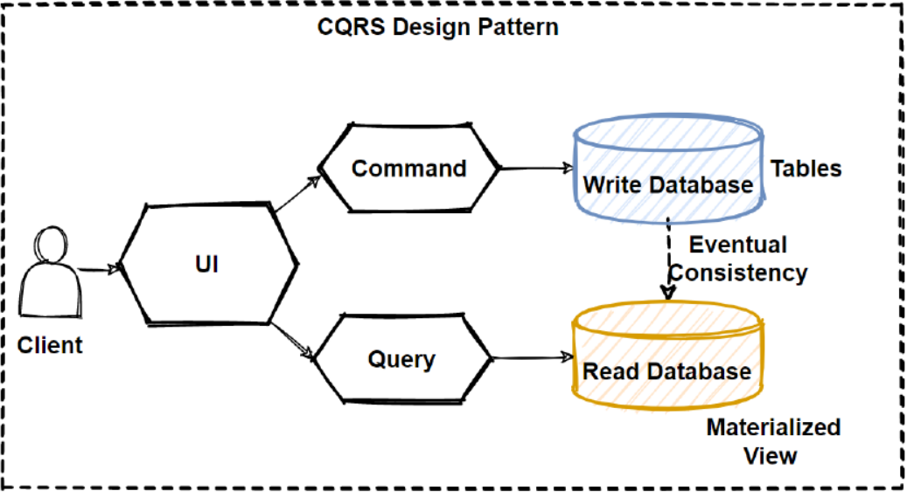

# Design Pattern

## 1. SAGA pattern

In this pattern, we perform the individual operations that are part of that transaction as a sequence of local transactions in each database.Each successful operation triggers the next operation in the sequence, and if a certain operation fails,the saga pattern rolls back the revious operation or operations by applying compensating operations that have the opposite effect from the original operations.

Saga Pattern Implementation
1. Workflow Orchestration
    
The first one is using a stateful workflow management service that orchestrates the entire transaction. The sole purpose of this service is to orchestrate the transaction in the correct order and also apply the compensating operations in the opposite order if things go wrong.
2.  Event Driven model

## 2. CQRS Pattern
    CQRS stands for "Command and Query Responsibility Segregation", in a typical system that involves data stored in a database. We can group the possible operations on that data into two types.
    1. Command :- An action that results in a data change.
        example : Insertion, Update, Deletion
    2.  Query :- Only read data, no data change
        Data can be returned AS-IS or transformed such as sorting, Aggregation.
    
    In CQRS, we essentially separate or segregate the code and storage for the command part of our system.
    

    Use-case 
    1.  Seperation of concerns
    2. Joining data from different sources

    
    Benefits
    1. Single responsibility Principle
    2. Higher performance
    3. Higher scalability

## 3. Event Sourcing Pattern

