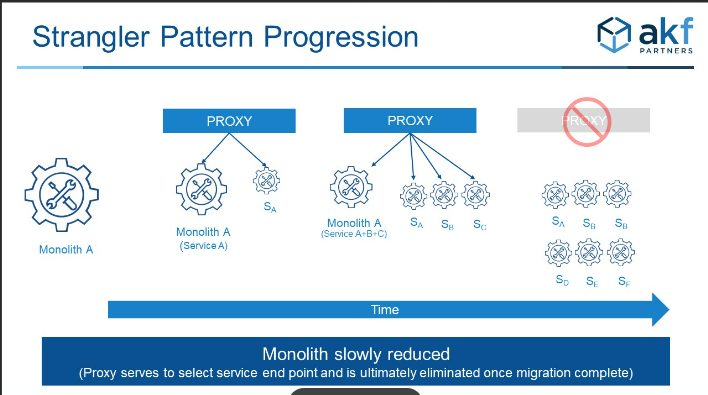

# Microservices

## Microservices boundaries - core principles

Let's consider a monolithic E-commerce applications, which grow in size, and have a huge codebase. in order to migrate it microservice application or distribute the application in micro service. we need to follow below  core principle

1. Coheision: Elements that are tightly related to each other and change together should stay together
    Cohesion will help with
    1.  The logic that changes together stays within the boundaries of the microservices
    2.  Each team can operate independently

2. single responsibility principle(SRP)
    Every microservices should do only one thing and do it exceptionally well.
    SRP will help with
    1.  Where new functionally needs to go and which team own what
    2.  Creates easy to follow API

3. Loose coupling
    little / no interdependency, minimum communication with other microservices
    1. The size of a microservice is not important
    2. The mocroservice can be different size

## Decomposition of a Monolithic applicatin to Microservices

1.  Decomposition by business Capabilities
    * Core capability that provides value to 
        1. Business
        2. Customers 
    Examples:
    * Revenue
    * Marketing
    * Customer experience
    
    Identify Business capabilities
    1.  Run a thought experiment
        *   "Describe the system to a non-technical person"
        *   Explain what the system does / what value each capability

2.  Decomposition by Domain / Subdomain
    *  In Decomposition by Domain / subdomain, We decompose the system into small sub domains where each subdomain is defined as sphere of knowledge, influence or activity. 
    Domain / subdomain of three types
    1.  Core - Key differentiator
        Cannot be bought of the shelve / outsourced
        without it, our business doesn't proivde value
        
    2.  Supporting:-
        Integral in delivering the core capabilities
        Is not different from our competitors

    3.  Generic :-
        Not specific to the business
        can bought / use off the shelve
    SubDomain catagorization helps
        Prioritize the investment into each subdomain
        Allocation engineers by experience
        save costs / time using off-the-shelf solutions

3.  Decomposition by Action
4.  Decomposition by Entities

Note:-
 decomposition by business capabilities and subdomain are most popular in the market.
 No "one right" way for decomposition into microservices
 NO perfect decomposition
 NO technique is bullet proof

 ## Migration to Microservices - steps, Tips and patterns
    
 ### Approaches

    Assuming that we have a very large code base that we want to modernize and migrate to microservices. Below are the approach to start the migration

    1. Big Bang approach
       The Plan:
       1.   Map out the micro services boundaries
       2.   Stop any development of new features

       On the surface
       1.   seems like a good idea
       In reality
       1. Worse approach

       Problems

       1. "Too many cooks in the kitchen" will create lot of friction.
       2.  Hard to estimate the effort for large and ambiguous projects
       3.  High risk of abandonment
       4.  Stopping development is detrimental to the business
    
    2. Incremental and Continuos Approach
        Identify the components that can benefit the most from the migration

        Best Candidates:
        1. Areas with the most development / frequent changes
        2. Components with high scalability requirements
        3. Components with the least technical debt
        Benefits:
        1.  no hard deadlines necessary
        2.  Consistent, visible and measurable progress
        3.  Business is not disrupted
        4.  Exceeding the time estimates is not problem

 ### Steps to prepare for migration
 1. Add / ensure code test coverage
 2. Define component API
 3. Isolate the component by removing interdependencies to the rest of the application

### Execute the migration

1. Strangler Fig Pattern by Martin fowler

    The idea behind Strangler Fig pattern is first to introduce a proxy in front of the monolithic legacy application. it simply allows requests to pass through. This proxy is commonly called the strangler facade and is typically implemented using an API gateway.

    

## Tips to ensure smooth Migration
    1. Keep the code and technology stack unchanged
        Migration itself risk mitigation to the system. So changing the tech stack introduced more risk to the system, we can take up new tech stack once the migration is done
 