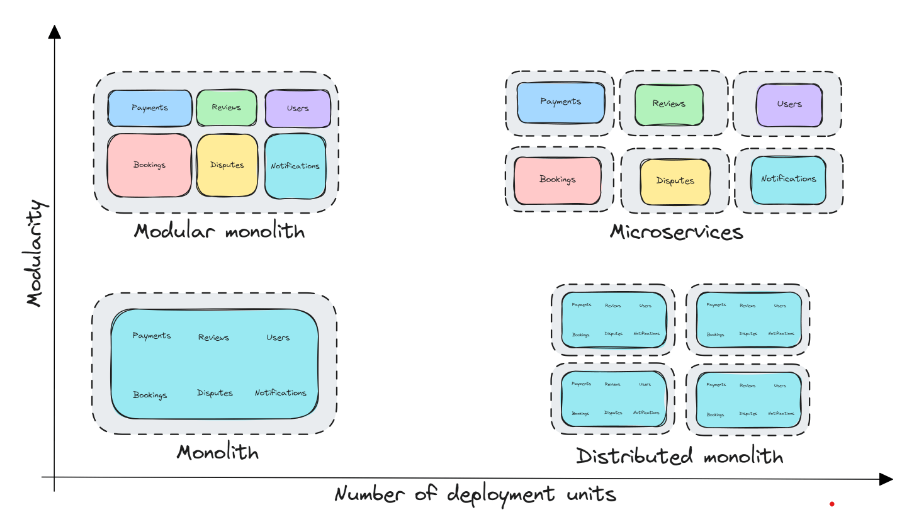

# Modular Monolith architecture

Modular monoliths blend the simplicity and robustness of traditional monolithic applications with the flexibility and scalability of microservices. I'm tempted to say they bring together the best of both worlds.

The modular monolith architecture allows you to work in a unified codebase with clearly defined boundaries and independent modules. You can have a high development velocity without the complexity of distributed systems.

## What is a Modular Monolith?

A modular monolith is an architectural pattern that structures the application into independent modules or components with well-defined boundaries. The modules are split based on logical boundaries, grouping together related functionalities. This approach significantly improves the cohesion of the system.

## what are the benefits of a modular design?

## Modular Architecture

Modular monoliths introduce a few important technical challenges that we will need to solve.
To achieve a modular architecture, the modules:

Must be independent and interchangeable
Must be able to provide the required functionality
Must have a well-defined interface exposed to other modules

Is it possible for a module to be completely independent? Not really. That would mean it's not integrated with other modules. We want loosely coupled modules and to keep the number of dependencies low. We can use a few techniques to keep the modules independent, and having good data isolation is one example.

Another factor you need to consider is how strong the dependency is. If two modules are very "chatty", you might have incorrectly defined the boundaries. You should consider merging these modules together.

Remember, a module is a grouping of related functionalities accessed via a well-defined interface.

Having a modular architecture allows you to easily extract modules into separate services.

## Monolith First

Microservices have become the most popular architectural pattern in recent years, and for good reason. Microservices offer many benefits like clearly defined service boundaries, independent deployments, independent scalability, and much more.

However, most teams would be better off starting with a monolith application.

A monolith is an architectural pattern where all components are deployed as a single physical deployment unit.

Even Google is jumping on board the modular monolith trend in their recent research paper, Towards Modern Development of Cloud Applications.

Here are the five main challenges Google identified with microservices:

Performance - The overhead of serializing data and sending it across the network has a noticeable impact on performance.
Correctness - It's difficult to reason about the correctness of a distributed system when there are many interactions between components.
Management - We have to manage multiple different applications, each with its release schedule.
Frozen APIs - Once an API is established, it becomes hard to change without breaking any existing API consumers.
Development speed - Making a change in one microservice may affect many other microservices, which requires carefully planning deployments.

## Benefits of a Modular Monolith

Modular monoliths have many benefits. So, I want to highlight a few that I consider important:

Simplified deployment - Unlike microservices, which require complex deployment strategies, a modular monolith can be deployed as a single unit.
Improved performance - Communication between modules occurs in-process. This means that there's no network latency or data serialization/deserialization overhead.
Enhanced development velocity - There's a single codebase to manage, simplifying debugging and the overall development experience.
Easier transaction management - Managing transactions in a distributed system is very challenging. Modular monoliths simplify this since modules can share the same database.
Lower operational complexity - Modular monoliths reduce the operational overhead that comes with managing and deploying a distributed microservices system.
Easier transition to Microservices - A well-structured modular monolith offers a clear path to a microservices architecture. You can gradually extract modules into separate services when the need arises.

## Modular Monolith vs Microservices

The biggest difference between modular monoliths and microservices is how they're deployed. Microservices elevate the logical boundaries inside a modular monolith into physical boundaries.

Microservices give you a clear strategy for modularity and decomposing the bounded contexts. But, you can also achieve this without building a distributed system. The problem is people end up using microservices to enforce code boundaries.

Instead, you can build a modular monolith to get most of the same benefits. Modular monoliths give you high cohesion, low coupling, data encapsulation, focus on business functionalities, and more.

Microservices give you all that, plus independent deployments, independent scalability, and the ability to use different technology stacks per service.

reference:-

[modular monolith](https://www.milanjovanovic.tech/blog/what-is-a-modular-monolith?utm_source=LinkedIn&utm_medium=social&utm_campaign=26.08.2024)