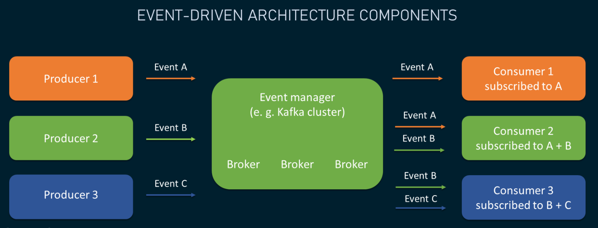
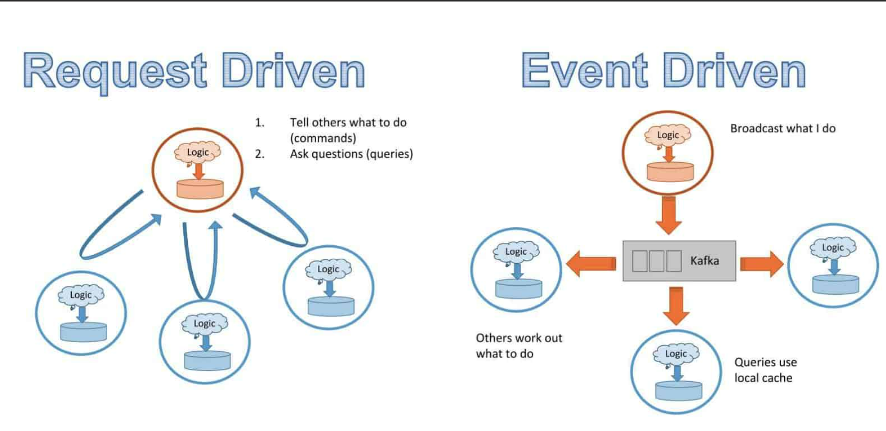

# Event -Driven Architecture

The main concept in event driven architecture is an event.An event represents a fact, an action or a state change that happens in our system and is always immutable. An event can be stored indefinitely within our system. An event can be consumed multiple times by different services.

## Event Driven architecture participents.
    There are three entities that participate in the exchange of events in an event driven architecture

1. producer who produces the events, 
2. A message broker which stores and routes those events.The message broker allows us to route a single event to as many consumers as we want.  It also adds a level of redundancy to our system, because once the event is produced into the message broker, it won't be lost and we can always retrieve it from the message broker.
3.  consumer or consumers that receive and process those events.
 
    Now let's talk about the 2 fundamental difference between Request-Response and Event-Driven Model

## Request-Response and Event-Driven Model
 1. synchronous vs asynchronous
    
    
Request-response model, when the sender sends a request, it must wait for a response, even if it contains no useful information. If the response never arrives.This usually indicates a problem.

On the other hand, in the event driven model, the publisher doesn't need to or expect to get any response from the consumer or the consumers of the events. And the delivery of the event to the consumer is outside of its control and responsibility. This allows the producer to move on to processing its next task instead of waiting for a response it doesn't actually need.

2.  Inversion of control

In the request response model, When the sender sends a request to the receiver, the sender needs to first be aware of the receiver and it also has to know exactly how to call it API.
If the sender needs to send a request to multiple receivers, it needs to be aware of all of them and also send the request to each one using their own unique parameters. This makes the sender depend on the receivers of the request.

On the other hand, in the event driven approach, the publisher doesn't care and may not even be aware of the consumers of the events. This completely decouples the producer from the consumers, as we recall The loose coupling of microservices is one of the main qualities we desire in our microservices architecture. This is why event driven architecture and microservices architecture go together with so much success.

## Usecases for event-driven architecture
    1. Fire and Forget
        The sender does not expect any data in return immediately or none at all. 
        example:-
        1.  When a user sends us a request to generate a report that may take a few minutes or even a few hours to be complete. So in this case, our event is the generate report action and the result will probably be sent to the user's email when this action is complete.
        2.  a user leaving a review on a product they purchased.
    
    2.  Reliable Delivery
        example:-
        1.  This is especially important in financial transactions where we cannot afford to lose messages in transit or need to guarantee certain delivery semantics.
    
    3.  Infinite stream of events

        example:-
        1.  location data from mobile devices or sensor data from Iot devices such as vacuum cleaners or autonomous cars.In this case, we have a continuous and infinite stream of data coming into our system, and we need to either analyze, aggregate, transform or store that data in real time.
    4.  aAomaly detection or pattern recognition
    5.  Broadcasting
    6.  Buffering

## usecase for Request-Response architecture
    1.  Immediate response with data is needed
    2.  Simple Interaction
    
## In Reality

A typical microservices architecture combines event driven architecture and Synchronous request response model.
It's also better to start with just a simple request response model initially and then upgrade the critical parts to the event driven architecture where needed.

## Event Delivery Patterns
1. Event streaming
2. Pub/sub pattern

## message delivery semantics in microservices and event driven architecture.
    Sometimes, while traveling an event may lost between publisher, message broker and consumer.  
    In this scenorio , we need to come with some semantics, 
    1.  At-Most-Once :- 
    in this situation we are okay with potentially losing some data but want to avoid duplication of  events. when we use the at most once delivery semantics, we tell our publisher that if it doesn't receive an acknowledgement from the message broker, it should not resend the event.
    example:
    - Ride-sharing service
    2. At-least-Once :-
    In this situation, we agree that if a publisher does not receive an acknowledgement within a given period of time, it will resend the event to the message broker. This guarantees that we never lose the event, but it could result in the same event being stored in the message broker more than once.
    Example: 
    - Product Delivery Notification
    3.  Exactly-Once
    Most difficult to achieve
    Highest overhead /latency

## Message Broker Technologies - Delivery Guarantees

Apache Kafka
    Producer Delivery Semantics - At most once, At least once, Exactly once
    Consumer Receipt Semantics - At most once, At least once, Exactly once
    Note: Apache Kafka supports Exactly Once Delivery Semantics when transferring and processing data between Kafka topics.

Amazon SQS
    Amazon SQS Standard queues - At-least-once delivery
    Exactly-once processing - This applies only to publishing events into an SQS queue.

Google Cloud Pub/Sub
    Exactly-once delivery

Microsoft Azure
    Event Hubs output - Exactly Once Delivery
    Event Grid message delivery and retry - At Least Once Delivery
