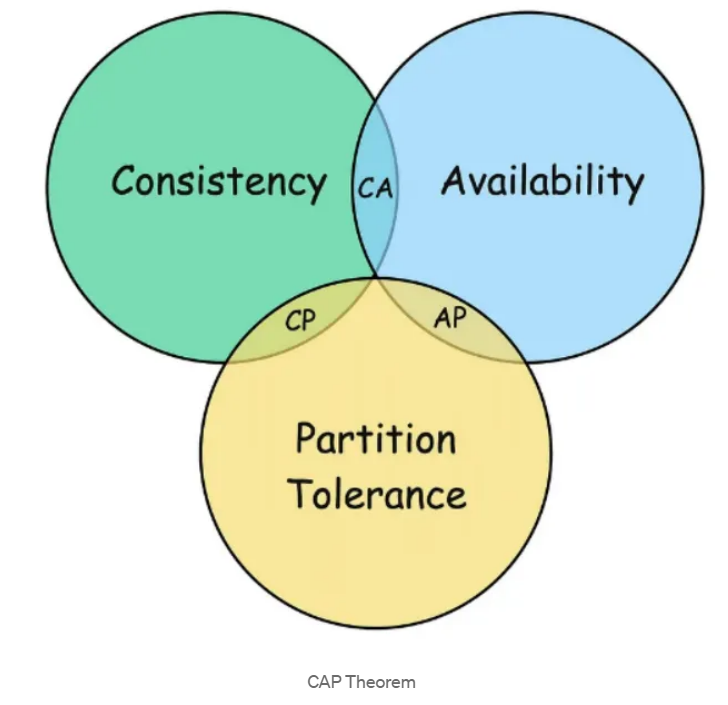

# CAP Theorem
The CAP Theorem is introduced by Eric Brewer in 2000, Which provides fundamental framework for understanding the trade-off that must made when designing distributed systems.

CAP stands for Consistency, Availability and Partition Tolerance. It is impossible for a distributed data store to simultaneously provide all three guarantees.

## 3 Pillers of CAP
### 1. Consistency
Every read receives the most recent write or an error. Which menase that all working nodes in a distributed system will return the same data at any given time.

In a consistent distributed system, if you write data to node A, a read operation from node B will immediately reflect the write operation on node A.

Consistency is crucial for applications where having the most up-to-date information is critical, such as in financial systems, where balance inquiries must reflect the current state of an account.

### 2. Availability
Every request receives a non-error response, without guarantee that it contains the most recent write. Which means that the system remains operational and responsive, even if the response from some of the nodes don’t reflect most up-to-date data.

### 3. Partition Tolerance
The system continues to operate despite an arbitrary number of messages being dropped by the network between nodes.

A network partition occurs when a network failure causes a distributed system to split into two or more groups of nodes that cannot communicate with each other. During network partition, the system must choose between consistency and availability.

Partition tolerance is essential for distributed systems because network failures can and do happen, a system that tolerates partitions can maintain operations across different network segments.

## The CAP Trade-off: choosing 2 out of 3
CAP Theorem asserts that in the presence of network partition, a distributed system must choose between consistency and availability.

Let explore these scenarios:

### CP(Consistency and partition Tolerance)
These systems prioritize consistency and can tolerate nework partition, but at the cost of availability. During a partition, the system may reject some requests to maintain consistency.

Databases such as MySQL and PostgreSQL are configured for strong consistency over availability during network partitions.

Examples:-

Banking Systems typically prioritize consistency over availability since data accuracy is more critical than availability during network issues.
2. Consider as ATM network for a bank, when you withdraw money, the system must ensure that you balance is updated accurately across all nodes to prevent overdrafts or other errors.

### AP (availability and Partition Tolerance)
These systems ensure availability and can tolerate partitions, but at the cost of consistency, during a partition, different nodes may return different values for the same data.

NoSQL databases like Cassendra and DynamoDB are designed to be highly available and partition-tolerent, potentially at the cost of strong consistency.

examples:-

Amazon’s shopping cart system is designed to always accept items, prioritizing availability. When you add items to your Amazon cart, the action almost never fails, even during high traffic periods like Black Friday.
### CA (Consistency and Availability)
In the absence of partitions, a system can be both consistent and available. However, network partitions are inevitable in distributed systems, making this combination impractical.

Examples:

Single-node databases can provide both consistency and availability but aren’t partition-tolerant. In a distributed setting, this combination is theoretically impossible.
## Practical Design Strategies
Designing distributed systems requires carefully balancing these trade-offs based on application requirements.

1. Eventual Consistency For many systems, strict consistency isn’t always necessary.
Eventual consistency can provide a good balance where updates are propagated to all nodes eventually, but not immediately.

Example: Systems where immediate consistency is not critical, such as DNS and content delivery networks (CDNs).

2. Strong Consistency A model ensuring that once a write is confirmed, any subsequent reads will return that value.

Example: Systems requiring high data accuracy, like financial applications and inventory management.

3. Tunable Consistency Tunable consistency allows systems to adjust their consistency levels based on specific needs, providing a balance between strong and eventual consistency.

Systems like Cassandra allow configuring the level of consistency on a per-query basis, providing flexibility.

Example: Applications needing different consistency levels for different operations, such as e-commerce platforms where order processing requires strong consistency, but product recommendations can tolerate eventual consistency.

4. Quorum-Based Approaches: Quorum-based approaches use voting among a group of nodes to ensure a certain level of consistency and fault tolerance.

Example: Systems needing a balance between consistency and availability, often used in consensus algorithms like Paxos and Raft.

## Beyond CAP: PACELC
While CAP is foundational, it doesn’t cover all scenarios. Daniel Abadi proposed the PACELC theorem as an extension by introducing latency and consistency as additional attributes of distributed systems.

If there is a partition (P), the trade-off is between availability and consistency (A and C). Else (E), the trade-off is between latency (L) and consistency ©.

This theorem acknowledges that even when the system is running normally, there’s a tradeoff between latency and consistency.

## Conclusion
In conclusion, the CAP Theorem is a powerful tool for understanding the inherent trade-offs in distributed system design. It’s not about choosing the “best” property, but rather about making informed decisions based on the specific needs of your application.

By carefully evaluating the CAP trade-offs, you can architect robust and resilient systems that deliver the right balance of consistency, availability, and partition tolerance.