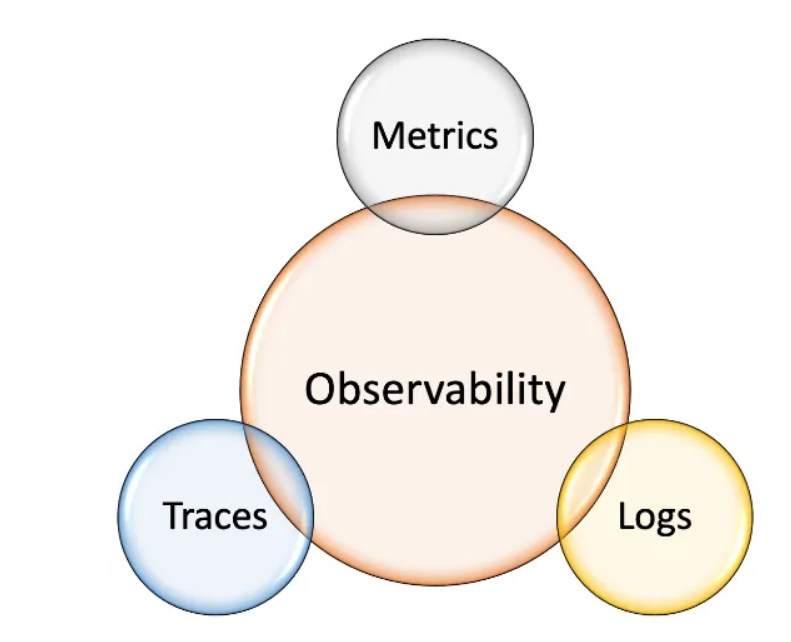
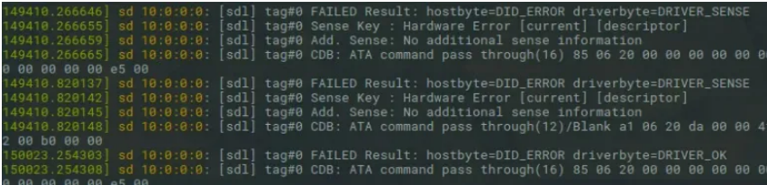
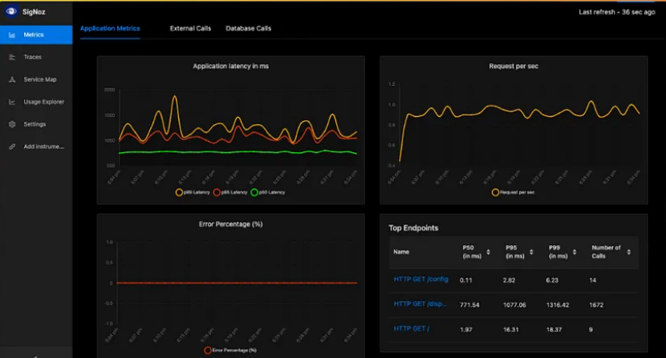
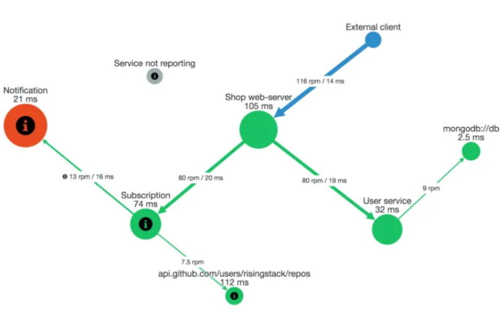

Observability allows users to actively debug, search for patterns, and trace microservice inputs and outputs. It provides insights into system behavior, enabling users to track individual requests, transactions, and events. Additionally, observability helps identify and isolate performance bottlenecks, directing attention to the root cause of issues.

On the other hand, Monitoring collects, Analyzes and displays pre-defined set of metrics, which enables Admins to detect when something goes wrong in the system. However, monitoring does not tell admins what is wrong or how to remediate the problem

while monitoring is very important for any type of system, observability is critical for microservice architecture

There are three Pillers of Observability

Distributed Logging
Metrics
Distributed Tracing

In this article, we will dive deep into the three pillars of observability

1. Distributed Logging
Logging is one of the simplest ways for developers to provide insights into the current state of an application.

A log entry can represent various events, such as receiving a new request, performing a database query, or initiating a complex processing operation. Logs also capture exceptions and errors, often accompanied by the parameters that led to the issue. This information is invaluable for debugging, fixing issues, and adding tests to prevent similar bugs in the future.

Example Log Entry
Best Practices for Distributed Logging
Below are given Best Practices for Distributed Logging.

1. Centralized Logging System
In a microservices architecture, where there can be thousands of instances of different microservices, it is impractical to manually check each one. So A centralized logging system is one of the best solutions for this challenge.

a. Move all logs to a centralized logging system that is scalable.

b. The centralized logging system should parse and index these logs, allowing for easy searching by patterns or groups.

2. Predefined Structure or Schema
Having a predefined structure or schema, along with consistent terminology across different events in microservices, is crucial. Log lines should be easy for both humans and machines to read.

3. Log level / log severity
Assign a log level to each log line based on the system and framework in use. Common log levels include, TRACE, DEBUG, INFO, WARN, ERROR, FATAL

4. Correlation ID
A correlation ID is important for tracing individual requests or transactions across multiple services.

5. Contextual Information in Log Lines
It’s essential to include contextual information in log lines to provide relevant details for debugging and analysis. Common data points to include are:

Service name
Hostname / IP address
User ID
Timestamp
Contextual Information Guidelines:

Log only necessary data: Avoid logging redundant or irrelevant information.
Do not log:
Sensitive data
Personally Identifiable Information (PII)
2. Metrics
Metrics are measurable signals from software that help us monitor the system’s health and performance. Metrics are regularly sampled, providing a continuous progression that allows us to monitor the system and detect anomalies as they occur. Typically, metrics come in numerical values, making them easy to quantify. This enables us to set alerts based on their direct or derived values, as they are simply numbers.

Since metrics are numeric values, they are easiest to collect, export into dashboard.

Here is list of metrics we can export to dashboard.

1. Regularly sampled data points

2. Numerical values like Counters, Distributions, Gauges

Examples: - Requests /min, Errors /Hours, Latency distribution, Current CPU utilization.

Even though we can collect anything in the metrics, it is not good practice to collect every data from the system. The 5 “Golden Signal / Metrics” Standard will provide the necessary metrics to collect.

The 5 “Golden signals / metrics”
The 5 “golden signal / metrics” standard will provide the most information and the lease amount of noise. The Five(golden) types of signals are sourced from “The Four golden Signals” (Google SRE book) and the USE method by Brendan Gregg.

Here are the 5 types of signal.

1. Traffic: Amount of demand being placed on our system per unit of time

Examples: HTTP requests/sec, Queries/sec, Transactions/sec, Events received/sec, Events delivered/sec, incoming requests + outgoing requests/sec.

2. Errors: Error Rate and Error Types

Examples: Number of application exceptions, HTTP response status codes(4XX, 5XX), Response exceeding latency thresholds, Failed Events, Failed Delivery, Aborted , transactions, Disk failures.

3. Latency: Time it takes for a service to process a request. Important considerations While taking Latency metrics are below.

- Latency distribution vs average

Don’t look just at the average latency, but always consider the full latency distribution.

- Separate successful operations from failed operations.

4. Saturation: How overload / full a service/resource is. Saturation is very important metrics in queue

5. Utilization: How busy a resource is (0–100%). This typically applies to resources with limited capacity like CPU, memory, disk space and so on.

The 5 golden aren’t the only one we should collect. depending on the requirement we can collect other metrics as well. But they are the most common and give us the most value by tracking them.

3. Distributed Tracing

Distributed tracing is a method of tracking requests as they flow through the entire system. starts at the client’s device all the way through our backend services and databases. As the request is being traced, we collect critical performance information about the time each part of the system is processing it.

Distributed tracing is not enough on its own to debug or troubleshoot the issue. but Distributed tracing helps to narrow down the faulty component and communication problem. once the problem is figured out, we can use logs and metrics to debug further.

Challenges with Distributed tracing is,

1. Manual instrumentation of code

2. cost

3. Big traces problem

Distributed Tracing Solutions:
OpenTelemetry — OpenTelemetry is a is a collection of APIs, SDKs, and tools for instrumenting, collecting, and exporting metrics, logs, and traces. It is open-source and is available in many programming languages such as C++, #/.NET, Erlang/Elixir, Go, Java, JavaScript, PHP, Python, Ruby, Rust, and Swift.

OpenTelemetry is also a specification that describes the cross-language requirements and expectations for all OpenTelemetry implementations.

Distributed Tracing Backends

Jaeger — Open source, distributed tracing platform that is cloud-native, infinitely scalable, and 100% free. It enables the monitoring of distributed workflows, tracking down root causes for performance bottlenecks, and analyzing service dependencies.

Requires OpenTelemetry for instrumentation.

Zipkin — Another open-source distributed tracing system. Its data served to the UI is stored in memory or persistently within Apache Cassandra or Elasticsearch. Originally developed at Twitter in 2010 and based on Google’s Dapper papers.

Supports a variety of official and community-created instrumentation frameworks.

Uptrace — Uptrace is an OpenTelemetry-based observability platform that helps you monitor, understand, and optimize distributed systems.

It is a commercial, cloud-based solution that supports a variety of features such as App Performance Monitoring, metrics collection and visualization, logs injection and analysis, and more.

1. Path of a given request through several microservices

2. Time each microservices took to process it

3. May include

- Request headers

- Response status code