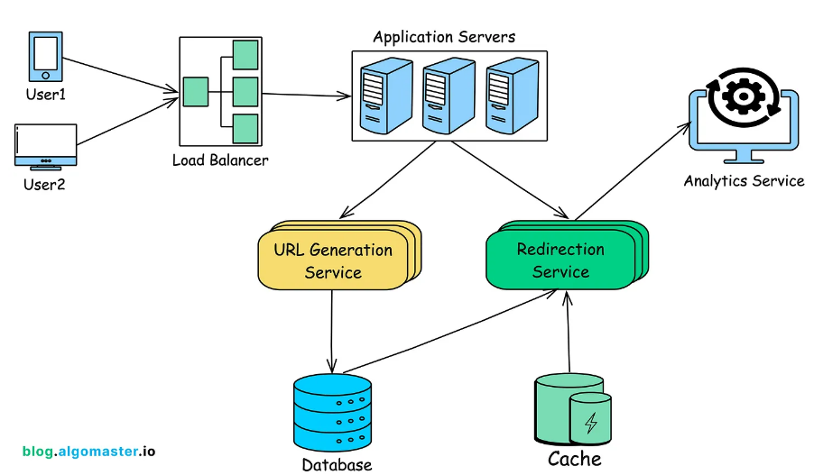
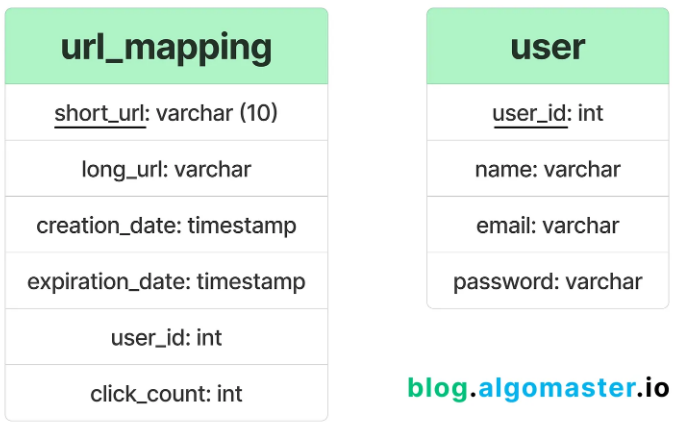

# TinyURL

A URL shortener is a service that takes the long URL and returns the shorter, unique alias that redirects to the original URL

These services are become the popular with the rise of social media platforms with characters limits and need for cleaner, more sharable links.

In this articles we will go through the process of designing scalable, efficient URL shortener service that can handle millions of URL, provide fast redirections and ensure high availability.

## Requirements

### Functional requirements

1.  Generate a unique short URL for a given URL
2.  Redirect the user to the original URL when the short URL is accessed
3.  Allow users to customize their short URL's
4. Support link expiration where URL's are no longer accessible after a certain period
5.  Provide analytics on link usage

### Non-Functional requirements
1.  High availability
2.  Low Latency
3.  scalability
4.  Durability
5.  Security to prevent malicious use, such as phishing

## Traffic

### Capacity Estimation
* Daily URL shortening request: 1 million requests per day
* Read:write ratio : 100:1( for every URL creation , we wxpect 100 redirects)
* Peak Traffic: 10X the average load(100 requests per second during peak hours)
* URL Lengths: Average original URL length of 100 characters

### Throughput Requirements

* Average Writes Per Second (WPS): (1,000,000 requests / 86,400 seconds) ≈ 12

* Peak WPS: 12 ×10 = 120

* Since Read:Write ratio is 100:1

* Average Redirects per second (RPS): 12 * 100 = 1,200

* Peak RPS: 120 * 100 = 12,000

### Storage Estimation:

For each shortened URL, we need to store the following information

* Short URL: 7 characters (Base62 encoded)
* Original URL: 100 characters(on average)
* Creation Date: 8 Bytes
* Expiration DateL 8 Bytes
* Click Count: 4 Bytes(integer)

Total Storage per URL
* Storage per URL:  7 + 100 + 8 + 8 + 4 =127 bytes

Storage requirements for one year

* Total URL's per year: 1,000,000 × 365 = 365,000,000

* Total Storage per Year: 365,000,000 × 127 bytes ≈ 46.4 GB

### Bandwidth Estimation
Assuming the HTTP 301 redirect response size is about 500 bytes(includes headers and the short URL)

* Total Read Bandwidth per Day: 100,000,000 × 500 bytes = 50 GB / day

* Peak Bandwidth: If peak traffic is 10x average, the peak bandwidth could be as high as 500 bytes × 12,000 RPS = 6 MB/s


### Caching Estimation

Since it's a read-heavy system, caching can signicantly reduce the latency for read requests

If we want tocache some of the hot URLs, we can follow the 80-20 rule where 20% of the URLsgenerate 80% of the traffic.

Since we have 1 million writes per day, if we only cache 20% of the hot urls in a day. Total cache memory required = 1M*0.2*127Bytes = 25.4MB

Assuming a cache hit ratio of 90%, we only need to handle 10% of the redirect requests directly from the database.

Request hitting the DB: 1200*0.10 ~= 120RPS

This is well within the capabilities of most distributed databases like DynamoDB or Cassandra, especially with sharding and partitioning.

### Infrastructure Sizing

To handle the above estimations

API servers: start with 4-6 instances behind a load balancer, each capable of handling 200-300RPS

DataBase: A distributed database with 10-20 nodes to handle both storage and high read/write throughput

cache Layer: A Distributed cache with 3-4 nodes, depending on the load and cache hit ratio.

## High Level Design

on high level, we would need following components in our design:



1.  LoadBalancers: distributes incoming requests across multiple application server
2. Application Servers: Handles incoming requests for shortening URL's and reqirecting users
3. URL generation service: Generates short URL's handles custom aliases and manages link expirations
4. Redirection service: redirects the users to the original URL
5. Database: stores mappings between short URL's and long URLs
6. cache: Stores frequently accessed URL mappings for faster retrieval
7. Analytics service: Tracks usage statistics like the number of clicks, geographic location, etc.

## Database Design

### SQL vs NoSQL

To choose the right datbase for our needs, let's consier some factors that can affect our choice:

* We need to store billions of records, 
* Most database operations are simple key- value lookups
* Read queries are much higher than write queries
* We don't need joins between tables
* Database needs to be highly scalable and available


a NoSQL database like DynamoDB or cassandra is a better option due to their ability to efficiently handle billions of simple key-value lookups and provide high scalability and availability.


### Databse Schema

We need 2 tables: one for storing url mappings and one for storing user related information



## System API Design
We'll design RESTful API's that are intuitive, effecient and scalable.

### URL Shortening API

Endpoint: POST /api/v1/shorten

This endpoint creates a short URL for a given long URL.

```
{
    "long_url": "https://example.com/very/long/url/that/needs/shortening",
    "custom_alias" : " ",
    "expiry_date": "2024-12-31T23:33:33Z",
    "user_id" : "user123"
}
```

Sample Resonse:
```
{
    "short_url" : "http://short.url/abc123"
    "long_url": "https://example.com/very/long/url/that/needs/shortening",
    "expiry_date": "2024-12-31T23:33:33Z",
    "created_at" : "2020-12-22T12:23:45Z"
}
```

### URL Redirection API

Endpoint GET / {short_url_key}

This endpoint redirects the user to the original long URL

Sample response

```
HTTP/1.1 301 Moved Permanently
Location: https://www.example.com/some/very/long/url
```
## Diving Deep into Key Components

### URL generator service

The primary function of the service is to generate a short, unique URL for each long URL provided by the user

Here are some things to think about when picking an algorith to shorten the URL

URL length: Shoerter is generally better, but it limits the number of possible distinct URL's you can generate.

Scalability: The algorithm should work well even with billions of URLs

Collosion Handling: THe algorithm should be able to handle duplicste url generations

APProach 1: HAshing and encoding

A common approach for generating short URL's is to use a hash function such as MD5 or SHA-256 to generate a fixed-length hash of the original URL.

This hash is then encoded into a shoerter form using Base62

Base62 uses alphanumeric characters(A-Z,a-z,0-9), which are URL-friendly and provide a dense encoding space.

The length of the short URL us determined by the number of characters in the Base62 encoded string.

Note: A 7-characters Base62 string can represent approximately 3.5 billion unique URL's 62^7

Example Workflow:

1.  User submits a request to generate short url for the long url: https://www.example.com/some/very/long/url/that/needs/to/be/shortened

2.  Generate an MD5 hash of the long URL. MD5 produces a 128-bit hash, typically a 32-character hexadecimal string: 1b3aabf5266b0f178f52e45f4bb430eb

3.  Instead of encoding the entire 128-bit hash, we typically use a portion of the hash (e.g., the first few bytes) to create a more manageable short URL.

4.  First 6 bytes of the hash: 1b3aabf5266b

5.  Convert these bytes to decimal: 1b3aabf5266b (hexadecimal) → 47770830013755 (decimal)

6.  Encode the result into a Base62 encoded string: DZFbb43

The specific choice of 6 bytes(48 bits) is important because it produses a decimal number that typically converts to a base62 string of approximately 7 characters.

issues with this  solution is:
1.  It can generate the same shortened url for the identical long url requests.
2.  Rarely Collisions can happen, where two different URL generate the same hash.

Collision Resolution stratergies:

1. Re-Hashing: If a collision is detected, the service can re-hash the original URL with a different seed or use additional bits from the original hash to generate a unique short URL.

2.  Incremental suffix: Another approah is to append an incremental suffix to the short URL untill a unique key is found

Approach 2: Unique ID Generation

Each new URL that is added to the system is assigned a unique, auto-incrementing ID.

Once the ID is generated, it is converted into shoerter, URL-friendly format using Base62 encoding, This encoded string become the short URL.


Because the IDs are generated incrementally, each new ID is unique and sequential. There is no possibility that two different URLs will receive the same ID, as long as the ID generation mechanism (e.g., a database with an auto-incrementing primary key) is functioning correctly.

There are few consideration in Incremental Id approach

1. Predictability: Incremental ID's are predictable, which menas that someone could potentially infer the number of URL's shortened by your service or guess other users URL's by simply incrementing the short URL.
    Mitigation: You can add a layer of obfusction by encoding th ID with a random seed or shuffling the ID before encoding it with Base61.

2.  Scalability: If not designed properly, a single point of ID generation can become a scalability bottleneck.
    Mitigation: Distributed ID generation strategies can be used to maintain scalability while preserving uniqueness

Approach 3: ZooKeeper

Zookeeper provides coordination services and configuration management for distributed systems
* Zookeeper manages distributed network, active servers, and elects leaders.
* Zookeeper provides a coordinated database and handles configurations.
* Zookeeper is used in the design of a distributed URL shortener system.

How it works?

1.  Assigning ranges to servers in a distributed system for URL shortening.
2.  Servers register themselves with a zookeeper and are assigned a range
3.  The range represents the counters used for URL shortening
4.  The counters are stored in memory and broken into ranges for efficient processing
5.  Shortened URLs are generated using a base 62 encoding
6.  The cache is used to store mappings for faster resolution

Advantage of using zookeeper

1.  Zookeeper provides collision-free and scalable URL shortening system design
2.  Zookeeper ensures unique counters for each server to prevent collisions
3.  Zookeeper enables seamless coordination and scalability of servers
4.  Consistency in data is achieved by setting replication factor and consistency level
5.  Zookeeper can be used for distributed caching with scalability

### Custom Aliasing

Custom Aliasing allows to specify their own hosrt URL instead of accepting a syste generated one.

This feature is especially usedfull for branding or memorable URL's

Custom Alias Validation

1. uniqueness Check
2. Character validation
3. Reserved aliases

Custom alias storage

    Alias Mapping
    Confilst Resolution

### Link Expiration

Link expiration allows URL;s to be valid only for a specified period, after which they become inactive

Expiration Date HAndling
    User-specified Expiration
    Default Expiration

Expiration Logic
    Backgorud jobs
    real-time Expiration
### Redirection Service
    When a user accesses a short URL, this service is responsible for redirecting the user to the original URL.

This involves 2 key steps

Database lookup : The Service Layer queries the database to retrieve the original URL associated with the short URL. 

Redirection :  Once the long URL is retrieved, the service issues an HTTP redirect response, sending the user to the original URL.

Example Workflow:

1. A user clicks on https://short.ly/abc123.

2.  The Redirection Service receives the request and extracts the short URL identifier (abc123).

3.  The service looks up abc123 in the database or cache to find the associated long URL.

4.  The service issues a 301 or 302 HTTP redirect response with the Location header set to the long URL (e.g., https://www.example.com/long-url).

5.  The user's browser follows the redirect and lands on the original URL.

### Caching for Performance

To reduce database load and improve latency, frequently accessed short URLs can be cached in an in-memory store like Redis.

The Redirection Service should first check the cache before querying the database.

### Analytics Service 

If the service needs to track analytics, such as the number of times a short URL is clicked, a separate analytics service can be introduced:
1.  Event Logging
2.  Batch Processing
For Analytic search, choose elastic search tool. to track the analytics

## Addressing Key Issues and bottlenecks

### Scalability

API Layer
Deploy the API layer across multiple instances behind a load balancer to distribute incoming requests evenly.


Sharding
Implement sharding to distribute data across multiple database nodes.

    Range-Based Sharding
    Hash-Based Sharding


Caching
Store frequently accessed short URL-to-long URL mappings in an in-memory cache like Redis or Memcached

### Availabilty

Replication
Use database replication to ensure that data is available even if some nodes fail.

Failover
Implement automated failover mechanisms for the API and data store layers to switch to backup servers in case of failure.

Geo-Distributed Deployment
Deploy the service across multiple geographical regions to reduce latency and improve availability.

### Handling Edge Cases

Expired URLs: If the short URL has expired, the service should return a meaningful response (eg.. HTTP 410) rather than attempting to redirect.

Non-Existent URLs: If the short URL does not exist in the database, the service should handle this gracefully (eg.. HTTP 404 Not Found status code).

URL Conflicts: If a conflict arises where multiple long URLs could map to the same short URL (due to a hash collision or manual alias conflict), the service should have a strategy to resolve this.


### Security

Rate Limiting
To prevent abuse (e.g., spamming the service with thousands of URLs), implement rate limiting at the API layer.

Input Validation
Ensure that the URLs being shortened do not contain malicious content.

HTTPS
All communication between clients and the service should be encrypted using HTTPS to prevent eavesdropping and man-in-the-middle attacks.

Monitoring and Alerts
Set up monitoring for unusual activity patterns and trigger alerts for potential DDoS attacks or misuse.
